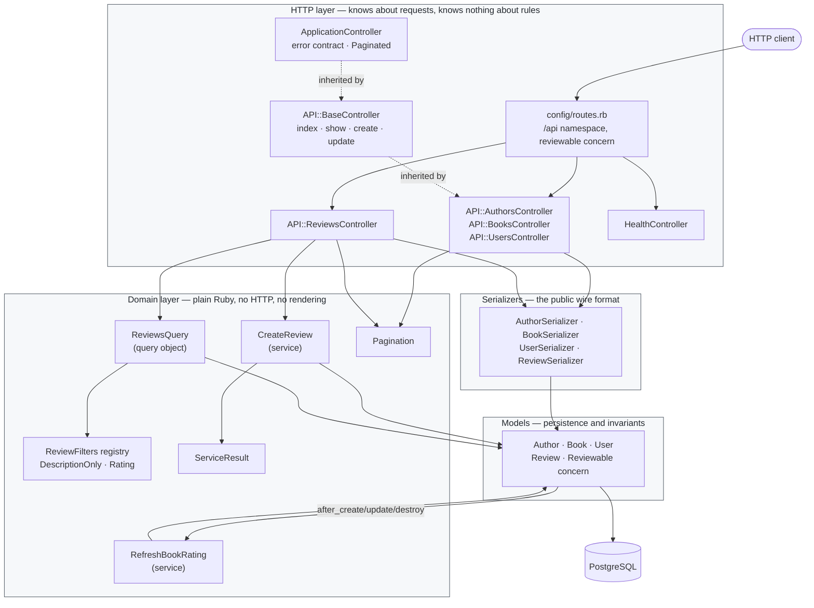
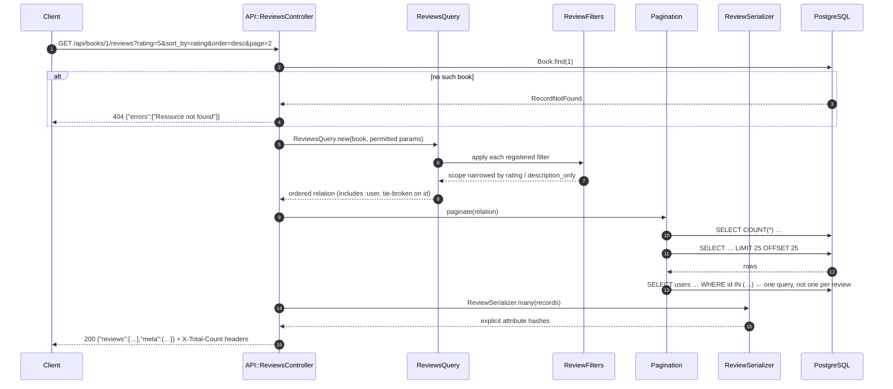
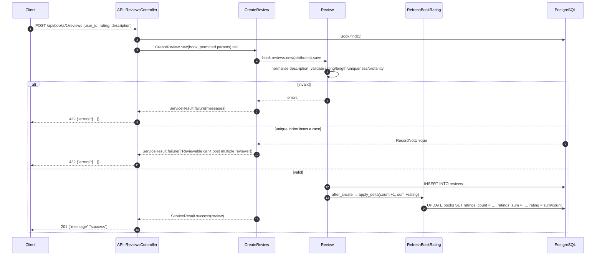

# Book Reviews

A JSON API (Rails 6.1, `config.api_only`) for cataloguing books and authors and
letting people review them. It was written as a take-home exercise: one review
per user per book, a required 1-5 rating, an optional description, and an
endpoint that returns a book's reviews with filtering and sorting. The stretch
goals — author reviews, a profanity filter and an average rating per book — are
implemented too.

There is no authentication layer. The reviewing user is identified by the
`user_id` sent with the request, which is what the exercise asked for and is
called out again under [Limitations](#limitations).

## The brief, and where each part lives

| The brief asked for | Status | Where it lives |
|---|---|---|
| A user can review a book | Done | `POST /api/books/:book_id/reviews` → `API::ReviewsController#create` → `CreateReview` |
| Only one review per user per book | Done | `Review` uniqueness validation **and** a unique index on `(user_id, reviewable_id, reviewable_type)`; the index is the real guard and a lost race is translated into the same 422 |
| A rating is required, 1-5 | Done | `Review` validates presence and `inclusion: 1..5`; `reviews.rating` is `NOT NULL` |
| A description is optional | Done | `allow_nil`, max 300 characters; blank and whitespace-only descriptions are normalised to `NULL` |
| An endpoint returning a book's reviews | Done | `GET /api/books/:book_id/reviews` |
| …filterable | Done | `?description_only=true`, `?rating=1..5` — `ReviewFilters` |
| …sortable | Done | `?sort_by=rating\|created_at\|updated_at&order=asc\|desc` — `ReviewsQuery`, whitelisted, tie-broken on `id` |
| *Stretch:* reviews of authors, not just books | Done | `reviews` is polymorphic; `GET/POST /api/authors/:author_id/reviews` |
| *Stretch:* profanity filter | Done | `Review#fictional_profanity` (a deliberately fictional word list) |
| *Stretch:* average rating per book | Done | `books.rating`, maintained in O(1) per write by `RefreshBookRating` — see [Design notes](#design-notes) |

Everything above is covered by the test suite; `bundle exec rspec` runs
150 examples.

## Captured output

This is a JSON API with no user interface, so there is nothing to screenshot.
Everything below is real output from the stack that `docker compose up --build`
starts, against the data in `db/seeds.rb`. The full transcript — seventeen
request/response pairs, the boot log, the test run and the linter — is in
[`docs/captured-output.md`](docs/captured-output.md).

**Booting, seeding and serving, in one command:**

```console
$ docker compose up --build
 Container book-reviews-db-1  Healthy
 Container book-reviews-api-1  Started
api-1  | ==> waiting for the database
api-1  | ==> preparing the database
api-1  | (schema load and migration output elided)
api-1  | Seeded 3 authors, 6 books, 5 users and 16 reviews.
api-1  | Puma starting in single mode...
api-1  | * Puma version: 5.3.2 (ruby 2.7.2-p137) ("Sweetnighter")
api-1  | *  Min threads: 5
api-1  | *  Max threads: 5
api-1  | *  Environment: production
api-1  | * Listening on http://0.0.0.0:3000
```

**A book's reviews, sorted and paginated** (abridged to one review; the paging
headers are on every collection response):

```console
$ curl -i 'http://localhost:8150/api/books/1/reviews?sort_by=rating&order=desc'
HTTP/1.1 200 OK
X-Page: 1
X-Per-Page: 25
X-Total-Count: 3
X-Total-Pages: 1

{
  "reviews": [
    {
      "id": 1,
      "rating": 5,
      "description": "Spare, patient and completely assured.",
      "reviewable_type": "Book",
      "reviewable_id": 1,
      "user_id": 1,
      "user": { "id": 1, "first_name": "Ada", "last_name": "Lovelace" },
      "created_at": "2026-09-23T12:03:02.590Z",
      "updated_at": "2026-09-23T12:03:02.590Z"
    }
  ],
  "meta": { "page": 1, "per_page": 25, "total": 3, "total_pages": 1 }
}
```

**Writing a review moves the book's average, in the same request:**

```console
$ curl http://localhost:8150/api/books/4
{ "id": 4, "title": "Small Gods", "rating": 4.0, "ratings_count": 1, ... }

$ curl -i -X POST http://localhost:8150/api/books/4/reviews \
    -H 'Content-Type: application/json' \
    -d '{"user_id":2,"rating":2,"description":"Not for me."}'
HTTP/1.1 201 Created

{ "message": "success" }

$ curl http://localhost:8150/api/books/4
{ "id": 4, "title": "Small Gods", "rating": 3.0, "ratings_count": 2, ... }
```

**One error shape, whatever went wrong:**

```console
$ curl -i -X POST http://localhost:8150/api/books/4/reviews \
    -H 'Content-Type: application/json' -d '{"user_id":2,"rating":5}'
HTTP/1.1 422 Unprocessable Entity
{ "errors": ["Reviewable can't post multiple reviews"] }

$ curl -i -X POST http://localhost:8150/api/books/5/reviews \
    -H 'Content-Type: application/json' -d '{"user_id":1,"rating":9}'
HTTP/1.1 422 Unprocessable Entity
{ "errors": ["Rating rating should be in range of 1..5"] }

$ curl -i -X POST http://localhost:8150/api/books/5/reviews \
    -H 'Content-Type: application/json' \
    -d '{"user_id":1,"rating":3,"description":"What a load of gorram nonsense."}'
HTTP/1.1 422 Unprocessable Entity
{ "errors": ["Description cannot contain fictional profanity"] }

$ curl -i 'http://localhost:8150/api/books/999999/reviews'
HTTP/1.1 404 Not Found
{ "errors": ["Resource not found"] }
```

**Untrusted input is clamped or ignored, never interpolated:**

```console
$ curl -i 'http://localhost:8150/api/books?page=-3&per_page=100000'
HTTP/1.1 200 OK
X-Page: 1
X-Per-Page: 100
X-Total-Count: 6
X-Total-Pages: 1

$ curl -i 'http://localhost:8150/api/books/1/reviews?sort_by=id%3BDROP%20TABLE%20reviews'
HTTP/1.1 200 OK        # unknown sort column, so the default id ordering applies
```

**The suite and the linter:**

```console
$ docker compose --profile test run --rm test
..............................................................................
......................................................................

Finished in 2.57 seconds (files took 0.70938 seconds to load)
150 examples, 0 failures

$ docker compose run --rm --no-deps api bundle exec rubocop
Inspecting 66 files
..................................................................

66 files inspected, no offenses detected
```

## Architecture



Dependencies point inward. Controllers know about services, query objects and
serializers; none of those know they are being called over HTTP. The models
know nothing about any of it except the one hook that keeps the rating counters
honest.

## Request flow

Reading a book's reviews:



Writing a review, and the average rating that follows from it:



## Quickstart

### Docker (recommended)

```sh
docker compose up --build
```

That starts PostgreSQL, creates and migrates the database, seeds it with six
books, three authors, five users and sixteen reviews, and serves the API on
**http://localhost:8150**. No other steps.

```sh
curl http://localhost:8150/health
curl http://localhost:8150/api/books
curl 'http://localhost:8150/api/books/1/reviews?sort_by=rating&order=desc'
```

Run the test suite in the same image:

```sh
docker compose --profile test run --rm test
```

Stop everything, including the database volume:

```sh
docker compose down -v
```

| Service | Host port | Notes |
|---|---|---|
| `api` | 8150 → 3000 | Puma, `RAILS_ENV=production`, healthchecked on `/health` |
| `db` | 8151 → 5432 | `postgres:13-alpine`, data in the `pgdata` volume |

### Without Docker

Requires Ruby 2.7.2 (see `.ruby-version`) and a local PostgreSQL.

```sh
bundle install
bin/rails db:setup        # create, load db/schema.rb, run db/seeds.rb
bin/rails s               # http://localhost:3000
```

## Configuration

Nothing is required in development or test; the defaults in
`config/database.yml` connect as the current OS user over the local socket.

| Variable | Required | Default | What it does |
|---|---|---|---|
| `DATABASE_URL` | No (yes in Docker) | unset | Standard Rails override, merged over `config/database.yml`. Compose sets it to the `db` service. |
| `RAILS_ENV` | No | `development` | Environment. The Docker image defaults to `production`. |
| `SECRET_KEY_BASE` | Only in production | generated per container | Rails refuses to boot in production without one. `bin/docker-entrypoint` generates an ephemeral value when it is unset so that local containers work without a master key; a real deployment must supply its own. |
| `RAILS_MASTER_KEY` | No | unset | Decrypts `config/credentials.yml.enc`. Not needed for anything this app currently does. |
| `RAILS_MAX_THREADS` | No | `5` | Puma thread pool **and** the Active Record connection pool size. Keep them equal. |
| `RAILS_MIN_THREADS` | No | `RAILS_MAX_THREADS` | Puma minimum threads. |
| `PORT` | No | `3000` | Port Puma binds inside the container. Compose maps 8150 → 3000. |
| `RAILS_LOG_TO_STDOUT` | No | set to `1` in the image | Log to stdout instead of `log/production.log`. |
| `RAILS_SERVE_STATIC_FILES` | No | unset | Serve `public/` from the app. Not used: there is no front end. |
| `HE_BETTER_READS_DATABASE_PASSWORD` | No | unset | Password for the `he_better_reads` role when `DATABASE_URL` is not set. |
| `SKIP_DB_PREPARE` | No | unset | Set to `1` to stop `bin/docker-entrypoint` preparing and seeding the database (used by the `test` service). |

## API reference

All resource endpoints live under `/api`. Requests and responses are JSON;
parameters may be sent as a JSON body or form-encoded.

**The error contract.** Every non-2xx response has the same shape,
`{"errors": ["…"]}`:

| Status | When |
|---|---|
| `400` | A required parameter is missing (`ActionController::ParameterMissing`). |
| `404` | No such record — `{"errors": ["Resource not found"]}`. |
| `422` | The request was understood and rejected by a validation. |
| `503` | `/health` only: the process is up but the database is not reachable. |

**Pagination.** Every collection endpoint is paginated: `?page=` (default 1)
and `?per_page=` (default 25, hard maximum 100). Out-of-range and non-numeric
values fall back to the defaults rather than erroring. Every collection
response carries `X-Page`, `X-Per-Page`, `X-Total-Count` and `X-Total-Pages`;
the reviews endpoint repeats them in a `meta` object because its body is
already an envelope.

### Reviews

| Method | Path |
|---|---|
| `GET` | `/api/books/:book_id/reviews` |
| `POST` | `/api/books/:book_id/reviews` |
| `GET` | `/api/authors/:author_id/reviews` |
| `POST` | `/api/authors/:author_id/reviews` |

**Create** accepts `user_id` (required, must exist), `rating` (required, whole
number 1-5) and `description` (optional, max 300 characters). A blank or
whitespace-only description is stored as `NULL`. On success it responds `201`
with `{"message": "success"}`.

```sh
curl -X POST http://localhost:8150/api/books/1/reviews \
  -H 'Content-Type: application/json' \
  -d '{"user_id": 1, "rating": 4, "description": "Enjoyed it"}'
```

Rejections you can expect:

* `Rating rating should be in range of 1..5` — rating missing or outside 1-5.
* `Reviewable can't post multiple reviews` — this user already reviewed this
  book or author.
* `Description cannot contain fictional profanity` — the description contains
  one of `frak`, `storms`, `gorram`, `nerfherder`, `crivens` as a whole word,
  case-insensitively.
* `Description is too long (maximum is 300 characters)`.
* `User must exist`.

**Index** returns `{"reviews": [...], "meta": {...}}` and accepts:

| Parameter | Values | Effect |
|---|---|---|
| `description_only` | any truthy value (`true`, `1`, …) | Only reviews that have a description. |
| `rating` | `1`-`5` | Only reviews with exactly that rating. Non-numeric or out-of-range values are ignored. |
| `sort_by` | `rating`, `created_at`, `updated_at` | Column to sort by. Anything else is ignored. |
| `order` | `asc`, `desc` | Direction, default `asc`. Ties break on `id`; with no `sort_by`, results come back in `id` order. |
| `page`, `per_page` | integers | See Pagination above. |

Each review is serialised with `id`, `rating`, `description`,
`reviewable_type`, `reviewable_id`, `user_id`, a compact `user`
(`id`, `first_name`, `last_name`), `created_at` and `updated_at`.

### Books

| Method | Path | Notes |
|---|---|---|
| `GET` | `/api/books` | Paginated, ordered by `id`. |
| `GET` | `/api/books/:id` | One book. |
| `POST` | `/api/books` | `title`, `description`, `publish_date`, `author_id`. `title`, `description` and an existing `author_id` are required. Returns `201`. |
| `PUT`/`PATCH` | `/api/books/:id` | Same attributes. |

`rating` and `ratings_count` are read-only: they are returned in responses and
ignored on write, because they are derived from the book's reviews. `rating` is
a JSON number rounded to two decimal places (`4.67`), or `null` for a book with
no reviews. The underlying column is an unconstrained `numeric`, which Rails
would otherwise render as the string `"4.6666666666666667"`; the rounding is
done in `BookSerializer`, because the wire format is the serializer's decision
and not the column type's. The exact figures behind the average are
`ratings_count` and, privately, `ratings_sum`.

### Authors

| Method | Path | Notes |
|---|---|---|
| `GET` | `/api/authors` | Paginated, ordered by `id`. |
| `GET` | `/api/authors/:id` | One author. |
| `POST` | `/api/authors` | `first_name`, `last_name`, `website`, `genres[]`, `description`. `description` is required. Returns `201`. |
| `PUT`/`PATCH` | `/api/authors/:id` | Same attributes. |

### Users

| Method | Path | Notes |
|---|---|---|
| `GET` | `/api/users` | Paginated, ordered by `id`. |
| `GET` | `/api/users/:id` | One user. |
| `POST` | `/api/users` | `first_name` and `last_name`, both required. Returns `201`. |
| `PUT`/`PATCH` | `/api/users/:id` | Same attributes. |

### Operations

| Method | Path | Notes |
|---|---|---|
| `GET` | `/health` | `200 {"status":"ok","database":"ok"}`, or `503` if Postgres is unreachable. Used by the container healthcheck. |

## Development

```sh
bundle install

# database
RAILS_ENV=test bin/rails db:create db:schema:load
bin/rails db:setup                 # development: create, load schema, seed

# tests
bundle exec rspec
bundle exec rspec spec/models/review_spec.rb

# linter
bundle exec rubocop
bundle exec rubocop -a             # safe autocorrect

# repair the denormalised rating columns from the reviews table
bin/rails ratings:recalculate
```

Or, entirely inside Docker:

```sh
docker compose --profile test run --rm test                       # rspec
docker compose run --rm --no-deps api bundle exec rubocop         # rubocop
```

Examples run inside transactions (`use_transactional_fixtures`) and
FactoryBot's syntax methods are mixed in globally
(`spec/support/factory_bot.rb`).

`Gemfile.lock` records `arm64-darwin`, `x86_64-darwin-19`, `x86_64-linux` and
`aarch64-linux`, so Bundler does not need `bundle lock --add-platform` on an
Apple Silicon machine or in a Linux container.

## Project structure

```
app/
  controllers/
    application_controller.rb       error contract (400/404/422) + Paginated
    concerns/paginated.rb           paginate(scope), X-Total-Count headers
    health_controller.rb            GET /health, used by the Docker healthcheck
    api/
      base_controller.rb            shared index/show/create/update
      authors_controller.rb         model + serializer + permitted params only
      books_controller.rb
      users_controller.rb
      reviews_controller.rb         its own create/index; uses CreateReview + ReviewsQuery
  queries/
    reviews_query.rb                filtering + whitelisted sorting for the reviews index
    review_filters.rb               the filter registry — the extension seam
    review_filters/
      description_only.rb           ?description_only=true
      rating.rb                     ?rating=1..5
    pagination.rb                   limit/offset with a hard cap
  serializers/
    application_serializer.rb       .one / .many
    author_serializer.rb            explicit attribute lists — the wire contract
    book_serializer.rb
    user_serializer.rb              plus .summary for embedding
    review_serializer.rb
  services/
    create_review.rb                the write path, returns a ServiceResult
    refresh_book_rating.rb          O(1) maintenance of books.rating + repair path
    service_result.rb
  models/
    author.rb  book.rb  user.rb
    review.rb                       validations, profanity check, counter hooks
    concerns/reviewable.rb          has_many :reviews, as: :reviewable
config/
  routes.rb                         /api namespace; `reviewable` concern nests reviews
db/
  migrate/  schema.rb  seeds.rb     seeds are idempotent and run on every container boot
lib/tasks/ratings.rake              rails ratings:recalculate
spec/
  models/  requests/  queries/  serializers/  services/  factories/  support/
docs/captured-output.md            real request/response transcripts (no UI to screenshot)
```

`config/initializers/inflections.rb` registers `API` as an acronym, which is
why the controllers live in `module API` while the route namespace is `:api`.

## Design notes

### Layering

The original exercise put everything in controllers and models. The code now
has four layers and each one has a single reason to change:

* **Controllers** deal with HTTP: find the resource named in the URL, permit
  parameters, pick a status code. `API::BaseController` holds the CRUD that
  authors, books and users share, so each of those controllers is a model, a
  serializer and a parameter whitelist and nothing else.
* **Services** (`app/services`) own write behaviour. `CreateReview` returns a
  `ServiceResult` rather than raising or rendering, so the same object is
  usable from a console, a rake task or a future background job.
* **Query objects** (`app/queries`) own read behaviour. `ReviewsQuery` turns
  untrusted query-string parameters into a relation; `Pagination` bounds it.
* **Serializers** (`app/serializers`) own the wire format. The API no longer
  calls `to_json` on an Active Record object anywhere, so adding a column is no
  longer an accidental, untested change to the public contract. `BookSerializer`
  exposes `ratings_count` and deliberately does not expose `ratings_sum`, which
  is an implementation detail of how the average is maintained; it also rounds
  `rating` to two places and emits it as a JSON number, rather than letting an
  unconstrained `numeric` column leak onto the wire as the string
  `"4.6666666666666667"`.

### Scalability

The honest bottleneck in this application is not throughput, it is the average
rating.

**The write path was O(number of reviews).** The average was recomputed with
`AVG(rating)` across the book's reviews after every insert, which means the most
reviewed book is also the slowest one to review — exactly backwards. `books`
now carries `ratings_count` and `ratings_sum`, both exact integers, and each
write applies a delta to them in one `UPDATE` that also derives the average from
the two columns:

```sql
UPDATE books
SET ratings_count = books.ratings_count + ?,
    ratings_sum   = books.ratings_sum   + ?,
    rating = CASE WHEN books.ratings_count + ? > 0
                  THEN (books.ratings_sum + ?)::decimal / (books.ratings_count + ?)
                  ELSE NULL END
WHERE id = ?
```

That is O(1) per write and, because the sum is an integer, it cannot accumulate
the rounding error that folding a new rating into a stored average would.
Updates and deletes apply the opposite delta, so destroying a user's reviews
corrects every affected book. `RefreshBookRating.recalculate!` recomputes the
counters from the reviews table and is exposed as `rails ratings:recalculate`:
denormalised data needs a repair path, not just a happy path.

**The read path was unbounded and unindexed.** `GET .../reviews` returned every
review a book had. It is now paginated with a hard ceiling of 100 per page, and
two composite indexes cover the shapes the endpoint actually issues:

```
(reviewable_type, reviewable_id, rating, id)
(reviewable_type, reviewable_id, created_at, id)
```

Both start with the reviewable, so the filter narrows and the sort is satisfied
from the index rather than by sorting the reviewable's rows; `id` is included
because the query object always appends it as the tie-breaker. The old
`(reviewable_type, reviewable_id)` index was dropped — it is a prefix of both
new ones, so it could serve nothing they cannot, and every insert was paying for
it. Sorting by `updated_at` is not covered: that would be a third index on a
write path, for a sort nobody asked for, over a partition that is small in
practice.

**The serializer would have N+1'd.** Rendering the reviewing user's name turns
one query into one-per-review. `ReviewsQuery` eager loads `:user`, so a page of
25 reviews costs one query for the reviews and one for the users; there is a
spec that fails if that regresses.

**Ordering and paging.** Every paginated scope has an explicit `ORDER BY`.
Without one Postgres may return rows in a different order on each call, and
limit/offset paging silently repeats or drops rows between pages.

### Extensibility

The seam is `ReviewFilters`. A filter is any object with `#param_name` and
`#apply(scope, value)`:

```ruby
class MinimumRating
  def param_name
    :min_rating
  end

  def apply(scope, value)
    value.present? ? scope.where('reviews.rating >= ?', value.to_i) : scope
  end
end

ReviewFilters.register(MinimumRating.new)
```

Registering it makes `?min_rating=4` work on both the book and author reviews
endpoints. `ReviewsQuery` iterates the registry and the controller permits
`ReviewFilters.param_names`, so neither has to change — the query object stays
closed for modification while the set of supported parameters stays open for
extension. There is a spec that registers a filter at runtime and asserts it
takes effect.

This is the seam a reviewing endpoint actually grows: "can I filter by date
range / by user / by minimum rating" is the next request in every version of
this brief. A provider interface or a plugin system would be inventing a problem.

### Things that were deliberately *not* added

This is a take-home exercise with a defined brief. No product features, and no
AI features, have been added to it: a reviewer is grading how well the brief was
executed, and bolting on extras is scope creep with a worse signal-to-noise
ratio than doing the stated job well. The only endpoint that exists beyond the
brief is `GET /health`, which is infrastructure for the container healthcheck.

## Limitations

* **No authentication or authorisation.** Any client can post a review as any
  `user_id`. The brief did not ask for auth and adding it would change the
  shape of every endpoint; in production this API would sit behind one, and
  `user_id` would come from the token rather than the body.
* **No rate limiting** and no abuse protection beyond the uniqueness constraint.
* **No review update or delete endpoints.** The model and the rating counters
  handle both correctly, and there are specs for them, but the brief only asked
  for creation and listing, so no routes are exposed.
* **The profanity filter is a five-word fictional blocklist**, matched on word
  boundaries. It is a demonstration of where the check belongs, not a real
  content-moderation system; a real one is a service with a maintained list,
  normalisation for leetspeak and an appeal path.
* **Pagination is limit/offset.** It is the right default and it is what a
  reviewer expects; at very deep offsets it degrades, and a keyset (`WHERE id >
  :last_id`) cursor would be the next step.
* **`books.rating` is denormalised.** It is maintained transactionally with the
  review that changes it and there is a repair task, but it is still derived
  data that can be corrupted by a direct `UPDATE`.
* **Author reviews have no average.** Only `books` has a rating column, which is
  what the brief described; `Review` skips the counter hooks for authors.
* **No caching layer and no background jobs.** At this size neither earns its
  operational cost; the write path is already O(1).
* **Ruby 2.7.2 and Rails 6.1** are both out of support upstream. Keeping them is
  deliberate — the repository is a record of the exercise as submitted, and
  upgrading the framework would make the diff about the upgrade rather than
  about the code.
